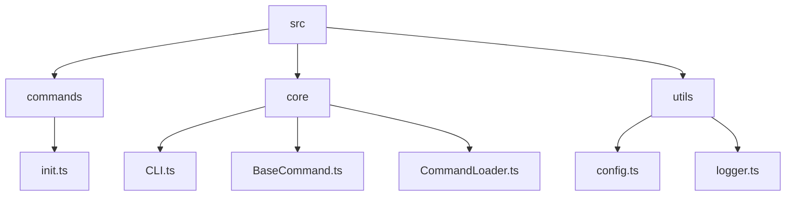

# @astrical/cli

The official Command Line Interface (CLI) for the Astrical framework.

This project serves as the primary entry point for managing Astrical projects, handling tasks such as project initialization, module management, and development workflows. It is designed to be **extensible**, **fast**, and **developer-friendly**, focusing on a clean architecture that allows for easy addition of new commands.

## Table of Contents

- [Purpose](#purpose)
- [Architecture & Design](#architecture--design)
- [Getting Started](#getting-started)
- [Project Structure](#project-structure)
- [Development Workflow](#development-workflow)
    - [Prerequisites](#prerequisites)
    - [Setup](#setup)
    - [Running Tests](#running-tests)
- [Adding New Commands](#adding-new-commands)
- [Contributing](#contributing)
- [License](#license)

---

## Purpose

The Astrical CLI allows developers to:
1.  **Initialize** new Astrical projects with best practices built-in.
2.  **Manage** project configuration and dependencies.
3.  **Extend** the framework functionality through modular commands.

It acts as a unification layer, bringing together various tools and configurations into a cohesive developer experience.

## Architecture & Design

This CLI is built with **TypeScript** and follows a **Class-Based Command Pattern** to ensure type safety and maintainability.

### Key Technologies
*   **[CAC (Command And Conquer)](https://github.com/cacjs/cac)**: A lightweight, robust framework for building CLIs. It handles argument parsing, help generation, and command registration.
*   **[Consola](https://github.com/unjs/consola)**: Elegant console logging with fallback and structured output capabilities.
*   **[Lilconfig](https://github.com/antonk52/lilconfig)**: Configuration loading (searching for `astrical.yml`, `astrical.yaml`) akin to `cosmiconfig` but lighter.
*   **Vitest**: A blazing fast unit test framework powered by Vite.

### Core Components
1.  **`CLI` Class** (`src/core/CLI.ts`): The orchestrator. It initializes the CAC instance, discovers commands using the `CommandLoader`, registers them, and handles the execution lifecycle.
2.  **`CommandLoader`** (`src/core/CommandLoader.ts`): Responsible for dynamically discovering and importing command files from the filesystem. It supports:
    *   Recursive directory scanning.
    *   Nested commands (e.g., `module/add.ts` -> `module add`).
    *   Index files as parent commands (e.g., `module/index.ts` -> `module`).
3.  **`BaseCommand`** (`src/core/BaseCommand.ts`): The abstract base class that all commands MUST extend. It provides:
    *   Standardized `init()` and `run()` lifecycle methods.
    *   Built-in access to global options (like `--root-dir`).
    *   Helper methods for logging (`this.log`, `this.warn`, `this.error`).
    *   Project root detection (`this.projectRoot`).

### Design Goals
*   **Zero-Config Defaults**: It should work out of the box but allow rich configuration via `astrical.yml`.
*   **Extensibility**: Adding a command should be as simple as adding a file.
*   **Testability**: Every component is designed to be unit-testable, with dependency injection where appropriate (e.g., `CommandLoader` importer).

---

## Getting Started

### Installation

While currently in development, you can run the CLI from the repository source or link it.

```bash
# From within the package directory
npm install
npm run build
```

### Usage

```bash
# Run the built CLI
npx astrical <command> [options]

# Example: Initialize a new project
npx astrical init my-new-project

# Get help
npx astrical help

# Get help for a specific command
npx astrical help init
npx astrical help module add
```

### Command Reference

#### `init`

Initializes a new Astrical project by cloning a starter repository, setting up dependencies, and preparing a fresh git history.

**Usage:**
```bash
npx astrical init <directory> [options]
```

**Arguments:**
- `directory` (Required): The directory to initialize the project in. If the directory does not exist, it will be created. If it does exist, it must be empty.

**Options:**
- `--repo <url>` (Default: `https://github.com/nexical/astrical-starter`): The URL of the starter repository to clone.
    - Supports standard Git URLs (e.g., `https://github.com/user/repo.git`).
    - Supports GitHub short syntax `gh@owner/repo` (e.g., `gh@nexical/astrical-starter`).

**What it does:**
1.  **Clones** the specified starter repository (recursively, including submodules) into the target directory.
2.  **Updates** all submodules to their latest `main` branch.
3.  **Installs** dependencies using `npm install`.
4.  **Resets** Git history:
    - Creates an orphan branch (`new-main`).
    - Commits all files as an "Initial commit".
    - Deletes the old history (removes `main`/`master`).
    - Renames the branch to `main`.
    - Removes the `origin` remote to prevent accidental pushes to the starter repo.

**Output:**
- A ready-to-use Astrical project in the specified directory, with fresh git history and installed dependencies.

---

#### `dev`

Starts the development server in ephemeral mode. It constructs a temporary build environment in `_site` and runs the Astro dev server with Hot Module Replacement (HMR).

**Usage:**
```bash
npx astrical dev
```

**What it does:**
1.  **Prepares** the `_site` directory by mounting `src/core`, `src/modules`, and content.
2.  **Starts** the Astro development server (accessible at `http://localhost:4321` by default).
3.  **Watches** for changes in your project and updates the ephemeral build automatically.

---

#### `build`

Compiles the project for production. It assembles the final site structure in `_site` and generates static assets.

**Usage:**
```bash
npx astrical build
```

**What it does:**
1.  **Cleans** the `_site` directory to ensure a fresh build.
2.  **Copies** all necessary source files (`src/core`, `src/modules`, `src/content`, `public`) into `_site`.
3.  **Runs** `astro build` to generate the production output in `_site/dist`.

**Output:**
- A production-ready static site in `_site/dist`.

---

#### `preview`

Previews the locally built production site. This is useful for verifying the output of `astrical build` before deploying.

**Usage:**
```bash
npx astrical preview
```

**Prerequisites:**
- You must run `astrical build` first.

**What it does:**
- Starts a local web server serving the static files from `_site/dist`.

---

#### `clean`

Removes generated build artifacts and temporary directories to ensure a clean state.

**Usage:**
```bash
npx astrical clean
```

**What it does:**
- Deletes `_site`, `dist`, and `node_modules/.vite`.

---

#### `run`

Executes a script within the Astrical environment context. This handles path resolution and environment variable setup for you.

**Usage:**
```bash
npx astrical run <script> [args...]
```

**Arguments:**
- `script` (Required): The name of the script to run.
    - Can be a standard `package.json` script (e.g., `test`).
    - Can be a module-specific script using `module:script` syntax (e.g., `blog:sync`).
- `args` (Optional): Additional arguments to pass to the script.

**Examples:**
```bash
# Run a core project script
npx astrical run test

# Run a script defined in the 'blog' module's package.json
npx astrical run blog:sync --force
```

---

#### `module`

Manages the modular architecture of your Astrical project. Allows you to add, remove, update, and list Git-based modules.

##### `module add`

Adds a new module as a Git submodule.

**Usage:**
```bash
npx astrical module add <url> [name]
```

**Arguments:**
- `url` (Required): The Git repository URL of the module.
    - Supports `gh@owner/repo` shorthand.
- `name` (Optional): The folder name for the module. Defaults to the repository name.

**What it does:**
1.  Adds the repository as a git submodule in `src/modules/<name>`.
2.  Installs any new dependencies via `npm install`.

##### `module list`

Lists all installed modules in the project.

**Usage:**
```bash
npx astrical module list
```

**Output:**
- A table showing the name, version, and description of each installed module found in `src/modules`.

##### `module update`

Updates one or all modules to their latest remote commit.

**Usage:**
```bash
npx astrical module update [name]
```

**Arguments:**
- `name` (Optional): The specific module to update. If omitted, all modules are updated.

**What it does:**
1.  Runs `git submodule update --remote --merge` for the target(s).
2.  Re-installs dependencies to ensure `package-lock.json` is consistent.

##### `module remove`

Removes an installed module and cleans up references.

**Usage:**
```bash
npx astrical module remove <name>
```

**Arguments:**
- `name` (Required): The name of the module to remove.

**What it does:**
1.  De-initializes the git submodule.
2.  Removes the module directory from `src/modules`.
3.  Cleans up internal git metadata (`.git/modules`).
4.  Updates `npm` dependencies.

---

## Project Structure



*   **`src/commands/`**: Contains the implementations of individual CLI commands. File names correspond to command names.
*   **`src/core/`**: The framework logic (Command loading, Base class, CLI orchestration).
*   **`src/utils/`**: Shared utilities (Logging, Configuration parsing).
*   **`test/unit/`**: Co-located unit tests. Mirrors the `src` structure.

---

## Development Workflow

### Prerequisites
*   Node.js (v18+ recommended)
*   NPM

### Setup

1.  **Install Dependencies**:
    ```bash
    npm install
    ```

2.  **Build in Watch Mode**:
    ```bash
    npm run dev
    ```
    This uses `tsup` to watch for changes and rebuild `dist/`.

### Running Tests

We prioritize **100% Test Coverage**. All logic branches, statements, and lines must be covered.

```bash
# Run all unit tests (with coverage report)
npm run test
```

Tests are written using `vitest` and are located in `test/unit/`. When submitting changes, ensure coverage remains at 100%.

---

## Adding New Commands

To create a new command, add a TypeScript file to `src/commands/`.

**Example:** Create `src/commands/hello.ts`

```typescript
import { BaseCommand } from '../core/BaseCommand.js';

export default class HelloCommand extends BaseCommand {
    // 1. Define command metadata
    static description = 'Say hello to the world';
    
    static args = {
        args: [
            { name: 'name', required: false, description: 'User name' }
        ],
        options: [
            { name: '--shout', description: 'Say it loud', default: false }
        ]
    };

    // 2. Implement the run method
    async run(options: any) {
        const name = options.name || 'World';
        
        if (options.shout) {
            this.success(`HELLO ${name.toUpperCase()}!`);
        } else {
            this.log(`Hello ${name}`);
        }
    }
}
```

**Key Requirement**: The file MUST default export a class extending `BaseCommand`.

*   **File Naming**:
    *   `hello.ts` -> Command: `hello`
    *   `users/create.ts` -> Command: `users create`
    *   `users/index.ts` -> Command: `users` (Parent command)

---

## Contributing

Contributions are welcome! Please follow these steps:
1.  Fork the repository.
2.  Create a feature branch.
3.  Add your changes and **ensure tests pass with 100% coverage**.
4.  Submit a Pull Request.

---

## License

This project is licensed under the **Apache License 2.0**.
