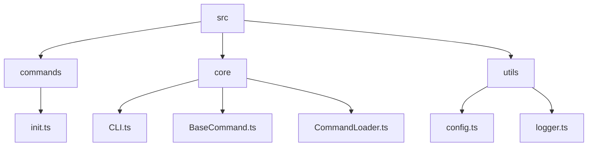

# @astrical/cli

The official Command Line Interface (CLI) for the Astrical framework.

This project serves as the primary entry point for managing Astrical projects, handling tasks such as project initialization, module management, and development workflows. It is designed to be **extensible**, **fast**, and **developer-friendly**, focusing on a clean architecture that allows for easy addition of new commands.

## Table of Contents

- [Purpose](#purpose)
- [Architecture & Design](#architecture--design)
- [Getting Started](#getting-started)
- [Project Structure](#project-structure)
- [Development Workflow](#development-workflow)
    - [Prerequisites](#prerequisites)
    - [Setup](#setup)
    - [Running Tests](#running-tests)
- [Adding New Commands](#adding-new-commands)
- [Contributing](#contributing)
- [License](#license)

---

## Purpose

The Astrical CLI allows developers to:
1.  **Initialize** new Astrical projects with best practices built-in.
2.  **Manage** project configuration and dependencies.
3.  **Extend** the framework functionality through modular commands.

It acts as a unification layer, bringing together various tools and configurations into a cohesive developer experience.

## Architecture & Design

This CLI is built with **TypeScript** and follows a **Class-Based Command Pattern** to ensure type safety and maintainability.

### Key Technologies
*   **[CAC (Command And Conquer)](https://github.com/cacjs/cac)**: A lightweight, robust framework for building CLIs. It handles argument parsing, help generation, and command registration.
*   **[Consola](https://github.com/unjs/consola)**: Elegant console logging with fallback and structured output capabilities.
*   **[Lilconfig](https://github.com/antonk52/lilconfig)**: Configuration loading (searching for `astrical.yml`, `astrical.yaml`) akin to `cosmiconfig` but lighter.
*   **Vitest**: A blazing fast unit test framework powered by Vite.

### Core Components
1.  **`CLI` Class** (`src/core/CLI.ts`): The orchestrator. It initializes the CAC instance, discovers commands using the `CommandLoader`, registers them, and handles the execution lifecycle.
2.  **`CommandLoader`** (`src/core/CommandLoader.ts`): Responsible for dynamically discovering and importing command files from the filesystem. It supports:
    *   Recursive directory scanning.
    *   Nested commands (e.g., `module/add.ts` -> `module add`).
    *   Index files as parent commands (e.g., `module/index.ts` -> `module`).
3.  **`BaseCommand`** (`src/core/BaseCommand.ts`): The abstract base class that all commands MUST extend. It provides:
    *   Standardized `init()` and `run()` lifecycle methods.
    *   Built-in access to global options (like `--root-dir`).
    *   Helper methods for logging (`this.log`, `this.warn`, `this.error`).
    *   Project root detection (`this.projectRoot`).

### Design Goals
*   **Zero-Config Defaults**: It should work out of the box but allow rich configuration via `astrical.yml`.
*   **Extensibility**: Adding a command should be as simple as adding a file.
*   **Testability**: Every component is designed to be unit-testable, with dependency injection where appropriate (e.g., `CommandLoader` importer).

---

## Getting Started

### Installation

While currently in development, you can run the CLI from the repository source or link it.

```bash
# From within the package directory
npm install
npm run build
```

### Usage

```bash
# Run the built CLI
npx astrical <command> [options]

# Example: Initialize a new project
npx astrical init my-new-project
```

---

## Project Structure



*   **`src/commands/`**: Contains the implementations of individual CLI commands. File names correspond to command names.
*   **`src/core/`**: The framework logic (Command loading, Base class, CLI orchestration).
*   **`src/utils/`**: Shared utilities (Logging, Configuration parsing).
*   **`test/unit/`**: Co-located unit tests. Mirrors the `src` structure.

---

## Development Workflow

### Prerequisites
*   Node.js (v18+ recommended)
*   NPM

### Setup

1.  **Install Dependencies**:
    ```bash
    npm install
    ```

2.  **Build in Watch Mode**:
    ```bash
    npm run dev
    ```
    This uses `tsup` to watch for changes and rebuild `dist/`.

### Running Tests

We prioritize **100% Test Coverage**. All logic branches, statements, and lines must be covered.

```bash
# Run all unit tests
npm run test

# Run tests with coverage report
npm run coverage
```

Tests are written using `vitest` and are located in `test/unit/`. When submitting changes, ensure coverage remains at 100%.

---

## Adding New Commands

To create a new command, add a TypeScript file to `src/commands/`.

**Example:** Create `src/commands/hello.ts`

```typescript
import { BaseCommand } from '../core/BaseCommand.js';

export default class HelloCommand extends BaseCommand {
    // 1. Define command metadata
    static description = 'Say hello to the world';
    
    static args = {
        args: [
            { name: 'name', required: false, description: 'User name' }
        ],
        options: [
            { name: '--shout', description: 'Say it loud', default: false }
        ]
    };

    // 2. Implement the run method
    async run(options: any) {
        const name = options.name || 'World';
        
        if (options.shout) {
            this.success(`HELLO ${name.toUpperCase()}!`);
        } else {
            this.log(`Hello ${name}`);
        }
    }
}
```

**Key Requirement**: The file MUST default export a class extending `BaseCommand`.

*   **File Naming**:
    *   `hello.ts` -> Command: `hello`
    *   `users/create.ts` -> Command: `users create`
    *   `users/index.ts` -> Command: `users` (Parent command)

---

## Contributing

Contributions are welcome! Please follow these steps:
1.  Fork the repository.
2.  Create a feature branch.
3.  Add your changes and **ensure tests pass with 100% coverage**.
4.  Submit a Pull Request.

---

## License

This project is licensed under the **Apache License 2.0**.
